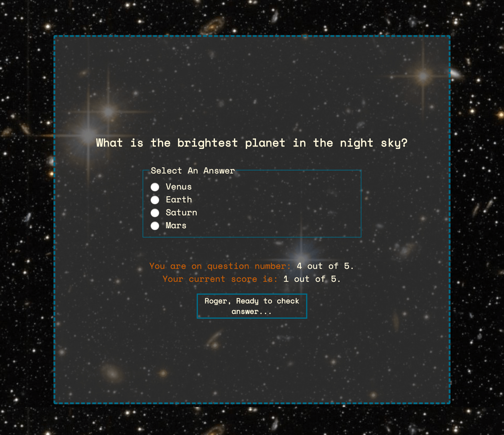
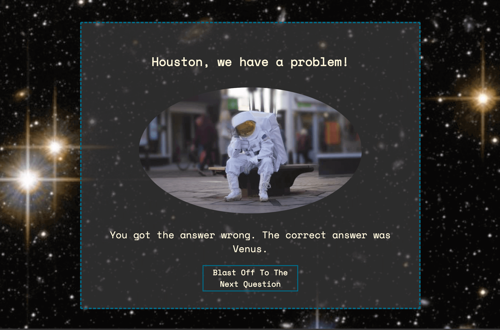

# Quiz App
Created by: Shannon Lichtenwalter & Lazandrea Celestine

### See It Live: 
https://shannon-lichtenwalter.github.io/space-quiz-app/

#### Summary
This simple quiz application tests the user's knowledge on 5 outer space questions.
The user is able to advance through the questions, keep track of their total score throughout their quiz, and get feedback on correct and incorrect answers. The user can retake the quiz at the end if they wish.

### Technology Stack
Javascript, JQuery, HTML, CSS

#### Screenshots

